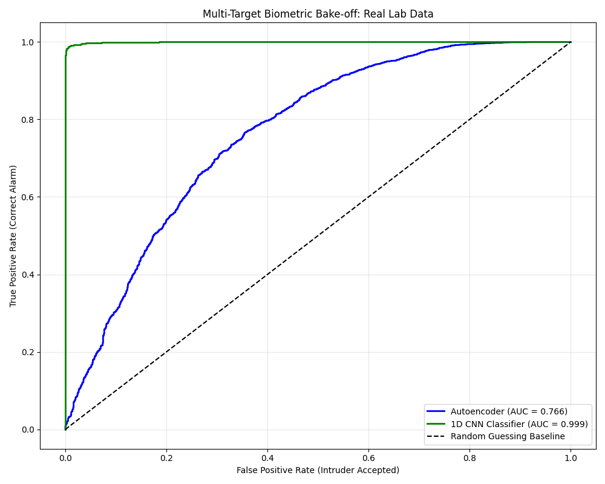

# ESP32 Edge-ML Radar Guard 📡🛡️
[A personal project inspired by RuView]
A privacy-preserving, contact-free continuous authentication and intruder detection system powered by Wi-Fi Channel State Information (CSI) and Deep Learning.

## 📖 Project Overview
Traditional security cameras and microphones inherently compromise privacy. This project bypasses optical sensors entirely by treating standard 2.4GHz Wi-Fi waves as a localized radar system. By parsing raw **Channel State Information (CSI)** from an ESP32-S3 microcontroller, the system models how a specific human body absorbs, refracts, and scatters RF waves. 

The pipeline uses customized deep learning architectures to authenticate a baseline user and flag unauthorized individuals (intruders) based purely on their physical water-mass and gait reflections.

## 🏗️ System Architecture

### The Hardware Setup
* **Transmitter (TX):** A standard smartphone hotspot broadcasting a stable 2.4 GHz 802.11n signal. 
* **Receiver (RX):** An ESP32-S3 running bare-metal C++ firmware to intercept packets and extract the 64-subcarrier amplitude matrices.
* **Topology:** TX and RX are placed 2-4 meters apart, forming an invisible RF tripwire (Fresnel Zone) that captures high-resolution torso reflections.

### The Physics: Background Subtraction (Tare)
Multipath interference from static objects (metal desks, 3D printers) easily corrupts Wi-Fi sensing data. This project implements a **Tare Calibration Filter**:
1. The system records an empty-room baseline for 10 seconds.
2. An environmental static reflection matrix is calculated.
3. During live tracking, this baseline is continuously subtracted from incoming data, isolating purely the dynamic human biometric signature.

## 🧠 Machine Learning Performance

The multi-target benchmark was conducted in a dense laboratory environment, evaluating one authorized user against three separate unauthorized intruders.

1. **Supervised 1D CNN (AUC: 0.995)**
   Treats the time-series subcarrier shifts as a 1D spatial image. By analyzing gait velocity and step frequency, it successfully drew a near-perfect boundary between the authorized user and intruders.
2. **Unsupervised Autoencoder (AUC: 0.758)**
   Trained *strictly* on the authorized user's normal walking profile. Despite being a zero-shot anomaly detector that had never seen the intruders before, it successfully flagged their physical presence as mathematical deviations from the baseline ~76% of the time.

## 📂 Repository Structure

* `/firmware/`: ESP-IDF C++ code for configuring the ESP32-S3 to extract CSI data.
* `/tools/`: 
  * `record_biometrics.py`: Serial COM port parser handling Tare subtraction and CSV generation.
  * `benchmark_models.py`: The TensorFlow/Keras deep learning bake-off script.
  * `csi_viewer.html`: A browser-based Web Serial API dashboard for real-time waveform visualization.
* `/data/`: Directory for capturing `_calib.csv` and `_data.csv` matrices.
